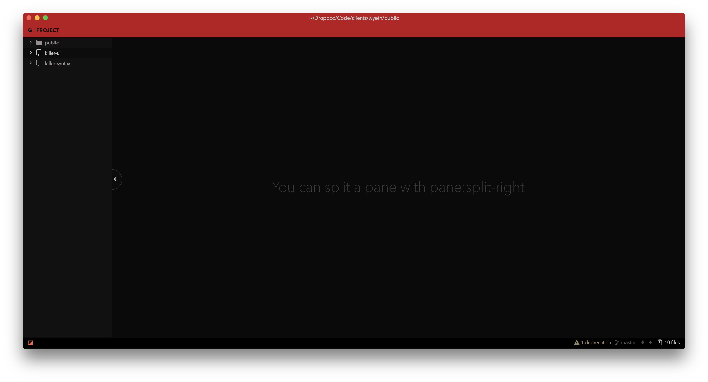
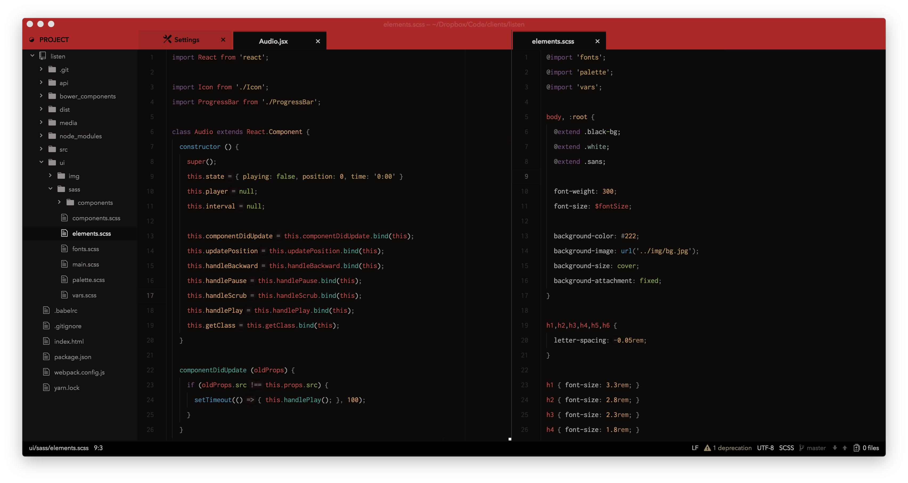
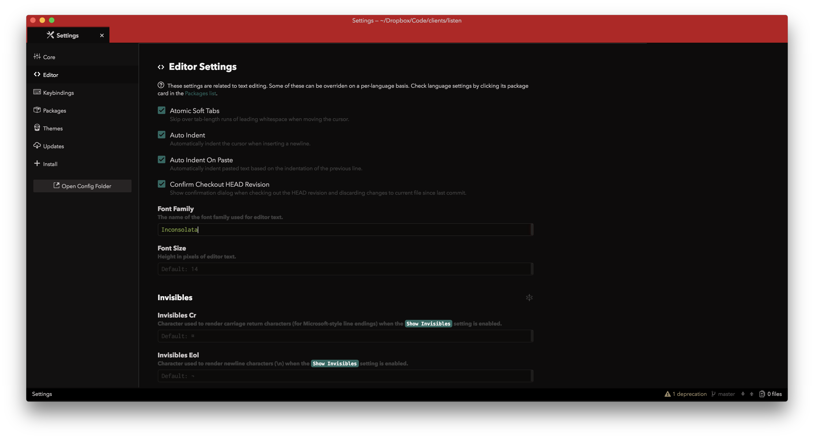

# Killer UI

**Killer UI** theme, by Austin Billings. Made for use with the [Killer Syntax](https://github.com/austinbillings/killer-syntax) theme.

## Optimal Fonts
The fonts you use are of course completely up to you, but **Killer** was designed with the following primary typefaces in mind:

- **Killer UI**: Avenir Next
- [**Killer Syntax**](https://github.com/austinbillings/killer-syntax): Inconsolata (with Menlo a close second), with editor line-height set to **2.0**.

